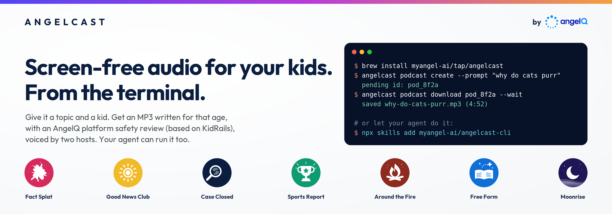
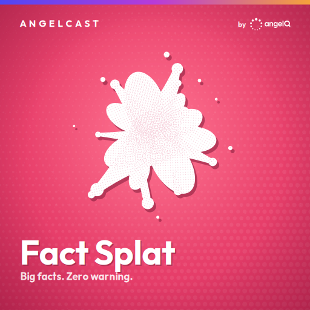
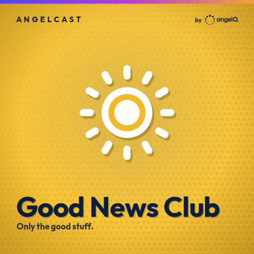
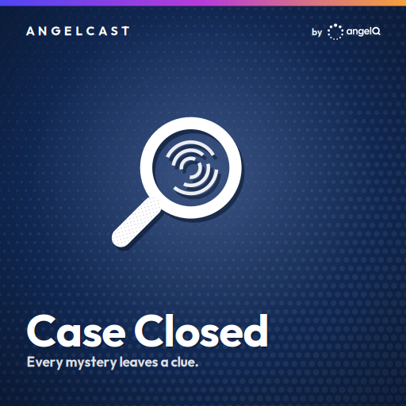
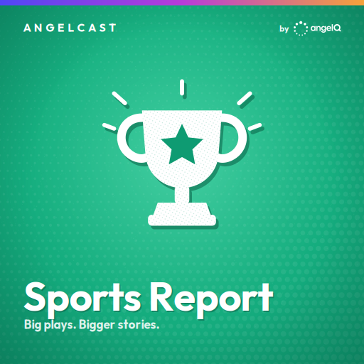
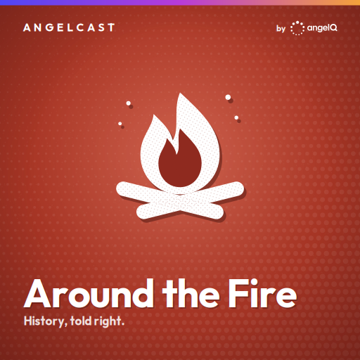
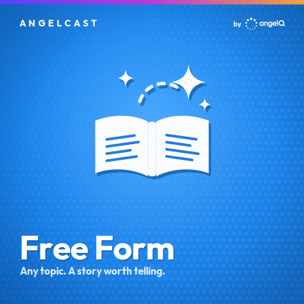
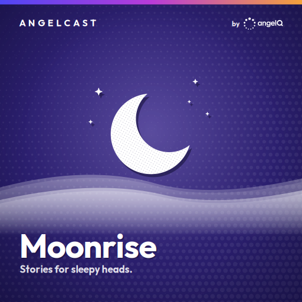

<a href="https://angelcast.rocks">
  <picture>
    <source media="(prefers-color-scheme: dark)" srcset="docs/assets/readme/banner-dark.png">
    
  </picture>
</a>

<p align="center">
  <b>angelcast</b> turns a topic into a short audio episode written for one child's age, checked by AngelQ's kid-safety layer (built on <a href="https://github.com/arcee-ai/KidRails">KidRails</a>), and voiced by two hosts.<br>
  Open source. Built for your agent to run.
</p>

<p align="center">
  <a href="https://angelcast.rocks"><b>Website</b></a> •
  <a href="docs/CLI.md"><b>CLI reference</b></a> •
  <a href="skills/angelcast/SKILL.md"><b>Agent skill</b></a> •
  <a href="PRIVACY.md"><b>What we keep</b></a> •
  <a href="https://github.com/arcee-ai/KidRails"><b>KidRails</b></a> •
  <a href="https://github.com/myangel-ai/angelcast-cli/issues"><b>Issues</b></a> •
  <a href="https://www.angelq.ai"><b>AngelQ</b></a>
</p>

<p align="center">
  <a href="LICENSE"></a>
  
  
  
  
</p>

<p align="center">
  
</p>

## Install
Are you using Claude Code, Codex, or another coding agent? Install the [agent skill](skills/angelcast/SKILL.md) and run `/angelcast` to have the skill walk you through setup!

```sh
npx skills add myangel-ai/angelcast-cli
```

Are you a more traditional CLI user? We've got you covered too! 
```sh
curl -fsSL https://github.com/myangel-ai/angelcast-cli/releases/latest/download/angelcast-cli-installer.sh | sh
```

```sh
brew install myangel-ai/tap/angelcast
```

Debian and Ubuntu users can grab the `.deb` from the [latest release](https://github.com/myangel-ai/angelcast-cli/releases/latest). macOS and Linux (x86_64 and arm64) are supported.

## Your first episode

```sh
# 1. Sign up with your first listener. Age shapes the vocabulary, pacing, and topics.
#    A magic link lands in your inbox; no password to remember.
angelcast family onboard --family-name Smith --email smith@example.com \
  --child-name Ava --child-birth-month 4 --child-birth-year 2018

# 2. Make Ada's first episode. --i lets you pick her from a list instead of pasting an id.
angelcast podcast create-ftue --prompt "outer space" --i

# 3. Listen. Episodes take a few minutes; --wait holds until it is ready.
angelcast podcast play <podcast-id> --wait

# 4. Add a sibling.
angelcast family add-member --first-name Sam --birth-month 9 --birth-year 2021

# 5. Make an episode for both of them. --i shows a checklist of your kids.
angelcast podcast create --prompt "Why do volcanoes erupt?" --audience multi-kid --i
```

Already have an account from the app? Skip step 1 and run `angelcast family login --email you@example.com --password`.
If you haven't set a password email us at support@angelq.ai, and we will get back to you!

Out of ideas? `angelcast podcast topic-suggestions` returns prompts picked for your kids' ages and interests.

## Seven show formats

The topic picks the format. Pin one with `--show-format`, or leave it out and the classifier decides.

<table>
  <tr>
    <td></td>
    <td></td>
    <td></td>
    <td></td>
    <td></td>
    <td></td>
    <td></td>
  </tr>
  <tr>
    <td align="center"><code>fact-splat</code></td>
    <td align="center"><code>good-news</code></td>
    <td align="center"><code>case-closed</code></td>
    <td align="center"><code>sports-report</code></td>
    <td align="center"><code>around-the-fire</code></td>
    <td align="center"><code>free-form</code></td>
    <td align="center"><code>story</code></td>
  </tr>
</table>

## What you can do

- **Create an episode from a prompt.** For one kid, several kids, or the whole family, in any of the seven formats above.
- **Run a series.** `angelcast series create --prompt "the solar system, one planet at a time"` plans a linked run of episodes that remember each other.
- **Play or download.** `podcast play` streams through your system player; `podcast download -o ./episodes/` keeps the mp3.
- **Track listening.** `podcast playbacks` shows what was played, where, and when.
- **Script everything.** Every command takes `--format json`; failures exit non-zero with the error code on stderr.

The full reference is in [docs/CLI.md](docs/CLI.md), or run `angelcast docs` for the same text offline.

## Use it from an agent

Angelcast is built to be driven by scripts and AI agents as much as by people. Output is JSON on request, and every failure exits non-zero with a greppable error code.

```sh
# Create an episode and capture its id
id=$(angelcast podcast create --prompt "How do bees make honey?" --format json | jq -r .podcast_id)
```

Example of requests you can ask your agent for in natural language:
```txt
Create me 2 podcasts for my child Ava with about sharks in the atlantic ocean. Download both to a new folder that is called AvaSharks
Create a series for me about dinosaurs that were in the midwest. Make it for the whole family. Save and upload to Yoto for me. 
Please create 10 episodes for a roadtrip through Massachusetts. Note the rate limits of 2 podcasts per 5 minutes and create accordingly. 
```

Using Claude Code, Codex, or another coding agent? Install the [agent skill](skills/angelcast/SKILL.md):

```sh
npx skills add myangel-ai/angelcast-cli
```

The installer needs Node 22.20 or newer (`node --version`).

Or add this to your project instructions and the agent can run the CLI on your behalf:

```markdown
The `angelcast` CLI is installed. Use `--format json` for every call and `angelcast docs` for the reference.
Never run `podcast delete` or `family remove-member` without confirming with me first.
```

Errors go to stderr as `error: <command> failed (<status>): <code>` and exit 1, so an agent can grep the code without parsing. Usage mistakes exit 2. Hitting the usage cap shows `weekly_limit_reached`; `angelcast family usage` reports what is left and when it resets.

## How it works, and why it is safe

Every episode is made by [AngelQ](https://angelq.ai). It writes for the audience, whether it is the family, child, or multiple children. Angelcast takes into account age to set vocabulary and pacing, and the interests you add shape the stories and examples. Every script is checked against AngelQ's kid-safety rules before it is voiced, so nothing reaches your kids that you would not want them to hear.

We use Mini Max H3 to generate some of our audio content.

## Limits
Each family can generate up to 36 episodes per rolling 7 days. There is a rate limit of 2 podcasts or 1 series per 5 minutes. Currently free.

## Help

- Full command reference: [docs/CLI.md](docs/CLI.md)
- Bugs, feature requests, and anything else: support@angelq.ai

If your kids loved an episode, tell us on X @angelq_ai !

## We build safety in the open

AngelQ co-created [KidRails](https://github.com/arcee-ai/KidRails) with [Arcee AI](https://www.arcee.ai): an open-source, child-safe language model and the training data and evals behind it, released so anyone can see and provide input to how AI should be used safely with kids. The same thinking shapes every Angelcast episode.

## License
[Terms of Use](https://www.angelq.ai/terms-of-use)
[Apache 2.0](LICENSE). AngelCast and AngelQ are trademarks of Angel AI Company; the license does not grant permission to use them.
